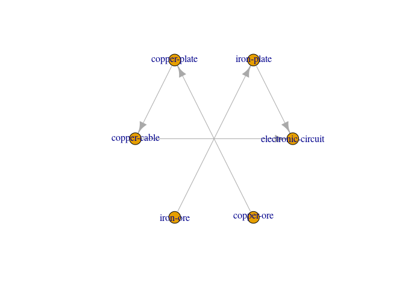
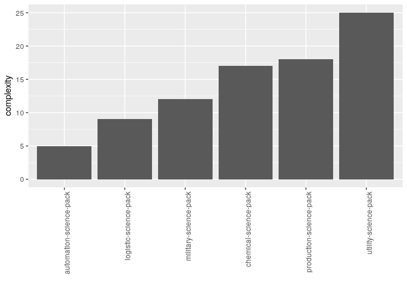
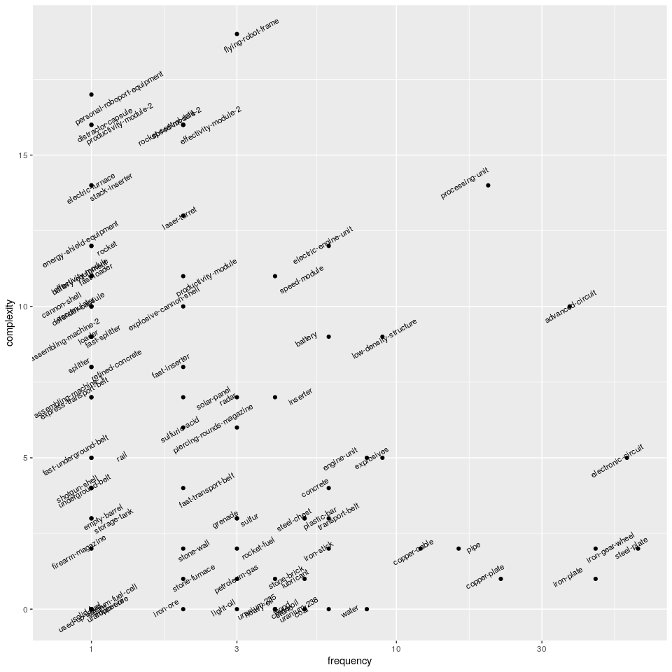

Manufacturing clusters
================

Export Factorio’s recipes into a sparse matrix (what inputs go into what
outputs), then do clustering to determine what assembling machines are
optimal to co-locate.

## Introduction

There are certain design questions in Factorio which some of us may not
find difficult to answer:

  - Should I produce e.g. advanced circuits at my main base or should I
    start a new location for this?
  - If I already have multiple sites, which should be extended with the
    new product?
  - Should I transport raw materials to the new site or should I
    transport intermediates?
  - Which materials should I transport on the rail network?
  - Which materials should I put on the main bus?

These are the questions we would like to answer through analysing local
recipe files. This is not a final analysis, rather a live document that
is updated every now and then.

## Product complexity

As your factory grows, adding a new production line becomes more and
more difficult and so at some point you will decide to start a new
location. Why would you do this?

You might feel that transporting raw materials to a new location and
building a new base is less time consuming to set up than adding the new
production line to your existing base. This could be because the new
product is quite complex. Let’s define the complexity of a product as
the number of manufacturing steps required to produce it. For example,
this is how an electronic circuit is produced:

<!-- -->

The number manufacturing steps (complexity) in this case is `5`. Let’s
calculate product complexity for each product. Here are a few:

    ##                         name complexity
    ## 1                accumulator         10
    ## 2           advanced-circuit         10
    ## 3    advanced-oil-processing          2
    ## 4      arithmetic-combinator          6
    ## 5            artillery-shell         17
    ## 6 artillery-targeting-remote         17

Let’s play with this a little, and plot the complexity of science packs.

<!-- -->

This complexity metric properly ranks product complexities, e.g. a
chemical science pack is more complex to produce than a logistic science
pack. However, this might not be an ideal complexity metric, e.g. we
would probably not say that a production science pack is about twice as
complex as a logistic science pack. But let’s ignore this for now.

## Frequency of use

Another thing you might consider in your decisions is how often this new
product will be used in other manufacturing processes. Let’s remove
items that are not used in any production steps (`61.1` percent of the
items) and plot product complexities as a function of product use
frequency. Let’s use a log 10 scale for the x axis for better
separation.

<!-- -->

For example, a processing unit is quite a complex product and it is used
in many other production lines. Therefore it might be worth to set up a
separate site for processing unit production, and either use the rail
network to transport processing units between sites, or put it on the
main bus if you wish to consume processing units at the same site they
are produced. On the other hand, a stone furnace is quite simple to
manufacture and it is not used in many products so it may be better to
manufacture stone furnaces locally for each process that uses it.
